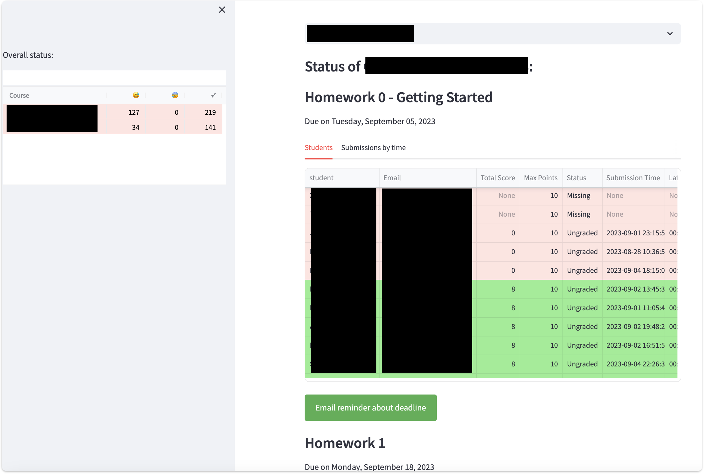

# Gradescope-Canvas Dashboard

The [Computer and Information Science Department at Penn](https://www.cis.upenn.edu/) is building cross-departmental monitoring tools to help with advising and student support.

Our goal is a single aggregation point for tracking student progress (and triggering alarms as appropriate) across many courses.  Ultimately there will be both "pull" and "push" components (messages vs dashboard).

We pull from both the Gradescope and Canvas APIs.



## Getting Started

This library requires a bit of setup to ensure it crawls Gradescope and Canvas appropriately.

1. Copy `config.yaml.default` to `config.yaml`
1. Log into Canvas, go into Account, Settings, and create a **New Access Token** (give it a name like "Canvas Monitoring") and copy the key.
1. Update the `config.yaml` as follows:
* Change the YAML key `gradescope` / `gs_login` to the Gradescope email address of an account given instructor permission on the courses you want to monitor.
* Update `gradescope` / `gs_pwd` to the password for above account.
* Update `canvas` / `api_key` to the new Canvas access token you created above.
* Set `site` to your Canvas host URL (e.g., `https://canvas.upenn.edu` for Penn)

Optionally you'll want to restrict the courses to a subset of the available ones:
* `canvas` / `course_ids`: a list of specific Canvas course IDs to crawl, rather than all that are currently active.  Each should be on a separate line indented with a leading dash
* `gradescope` / `semesters`: a list of the Gradescope "years" / semesters to crawl

Then set up and run the environment:

```bash
python -m venv venv # Create a virtual environment
chmod +x venv/bin/activate # Make the activate script executable
source venv/bin/activate # Activate the virtual environment
pip install -r requirements.txt # Install dependencies
python collect_events.py # Run the script
```

After the script runs, there should be a series of files in the current directory:
* `gs_courses.csv` / `canvas_courses.csv`: list of courses to which we have access
* `gs_assignments.csv` / `canvas_assignments.csv`: list of student assignments (quizzes, exams, HWs)
* `gs_students.csv` / `canvas_students.csv`: list of enrolled students by course_id
* `gs_extensions.csv` / `canvas_student_summaries.csv`: list of student info including late days, extensions, etc.
* `gs_submissions.csv` / `canvas_submissions.csv`: list of homework submissions including timestamps, whether late, etc.

## Usage

On a daily basis, you should run the crawler tool to generate a fresh version of your course data (perhaps through `chron`):

```
python collect_events.py
```

To see the dashboard, run:

```
streamlit dashboard.py
```


## API Alternative

Alternatively, you can use the libraries directly:

```
import pandas as pd
from gscdash.pycanvas.pycanvas import CanvasStatus
from gscdash.pyscope.pyscope import GradescopeStatus

# Restrict to these course IDs
canvas_course_list = []

# Restrict to these semesters
gradescope_sem_list = []

canvas = CanvasStatus(canvas_url, canvas_api_key, canvas_course_list)
canvas_courses, all_students, all_assignments, all_submissions, all_student_summaries = canvas.get_course_info()

gs = GradescopeStatus(email, pwd, gradescope_sem_list)
gs_courses, gs_students, gs_assignments, gs_submissions, gs_extensions = gs.get_course_info()

```

## Potential To-Dos:
* Add download from Gradescope Review Similarity for each assignment?
* Generate ics for all deadlines?

## Gradescope APIs

We leverage and adapt the `pyscope` API, which we have updated to 2023 Gradescope with extensions.  Gradescope does not really have an external API, but through some clever work by prior authors, HTML crawling is used to pull the important data and wrap it in objects.

**Credit**: The `pyscope` codebase is derived from Sagar Reddy Patil's Gradescope iCalendar Converter, [sagarredypatil/gradescope-ics](https://github.com/sagarredypatil/gradescope-ics), which also leverages the original Gradescope codebase from Anton Pozharski, [apozharski/gradescope-api](https://github.com/apozharski/gradescope-api).  This overall package inherits the AGPL license as a result of this.  However, new subsystems use the standard Apache 2 license.

**Major changes**:
* Support for extracting courses for which we have either *instructor* or *student* access.  Instructor access has more comprehensive support, e.g., of downloading rosters.
* Instructor access uses the full **assignments** page rather than the main dashboard, for comprehensiveness.  This requires changes to parsing.
* New `course.get_roster()` API call.
* Roster extraction update to match the 2023 HTML formatting of Gradescope.
* Homework assignment extraction now pulls the assignment ID.
* Extraction of homework submissions.
* Extraction of homework extensions.

## Canvas APIs

We leverage the Canvas LTI APIs from the U of Florida library.  Substantial layering over these libraries has been added in the `pycanvas` package, and a common API between the Canvas and Gradescope modules has been implemented as `CourseApi`.

